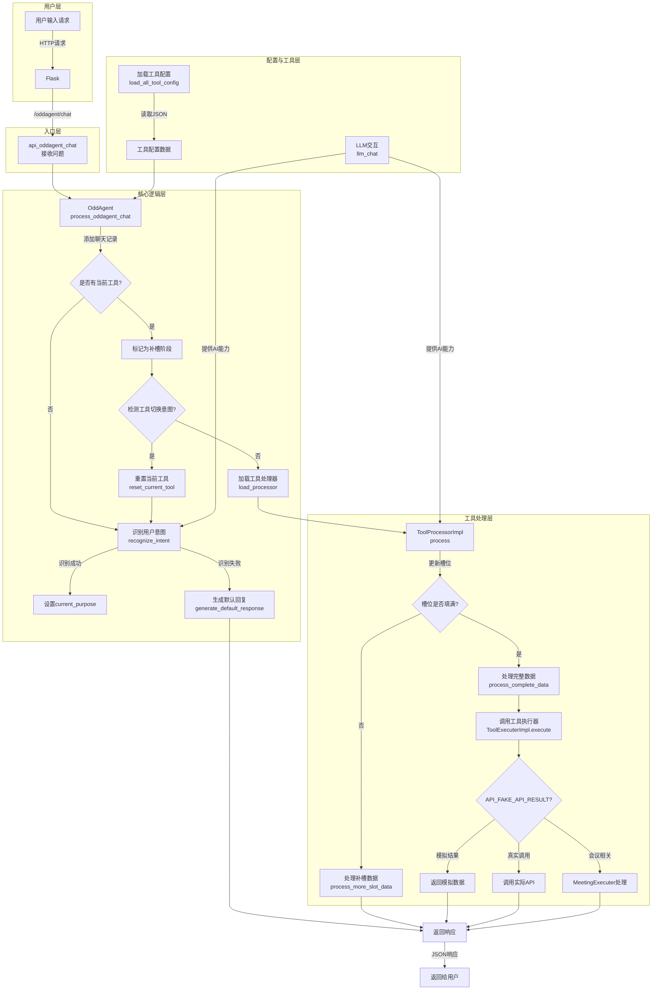
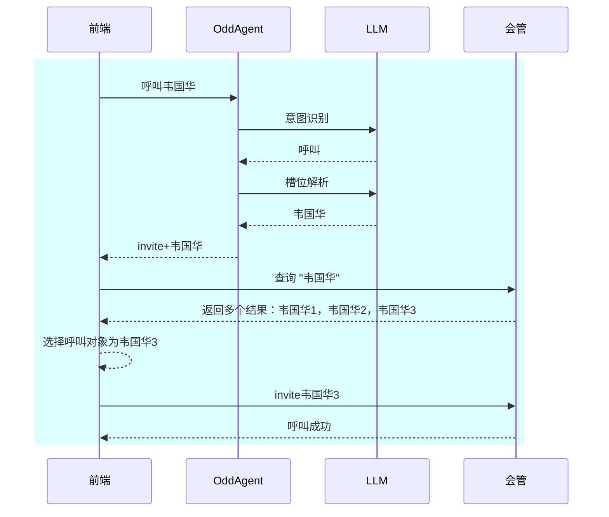
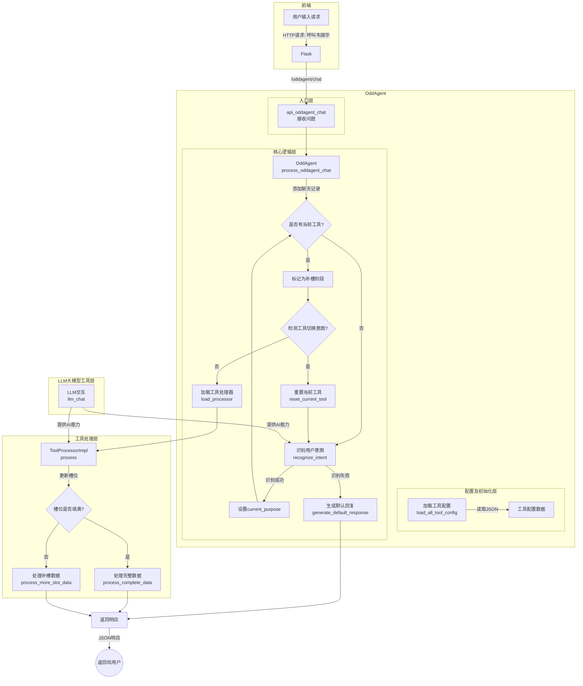

# 20251116 OddAgent 工作流程调整

## 当前OddAgent的流程图

## 设计变更

考虑到在实际的需求中，最终调用的工具及其API可能不是自己实现的，而是第三方的，最后这些工具及API千奇百怪的各种实现方法都有，无法简单将其API接口及参数等进行规约，因此，拟对OddAgent设计上进行调整，将其现有的工具调用部分进行剥离。

拟调整的方向如下图所示。

整个流程里OddAgent后端只负责意图识别、槽位解析，以及在槽位不满、需要多轮交互的场景下的会话管理，槽位补齐的工作。

## 调整后的流程图

